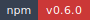

<!-- markdownlint-disable MD013 MD033 -->
<!-- This file is generated by Paradox. Do not edit manually. -->

# @ankhorage/ankh

        

Bun-first Ankh CLI front door and command bus bootstrap package.

## Usage

### Bootstrap status

`@ankhorage/ankh` is the root CLI front door and command bus for Ankhorage.

`ankh commands` currently lists discovered Ankh package metadata and
capabilities only.

No domain behavior belongs in the root CLI. Domain behavior stays in provider
packages such as infra, templates, studio, board, doctor, and dev.

Current built-ins are `help`, `commands`, and `version`.

Provider manifest loading, command descriptors, category help, and command
execution are deferred beyond `ankhorage/ankh#2`.

Source: `src/readme-usage.ts`

```ts
import { runCli } from "./cli.js";

await runCli(["--help"]);
```

## Installation

```bash
bunx @ankhorage/ankh
```

## Generated documentation

- [Interactive documentation app](./paradox/index.html)
- [Public API reference](./paradox/exports.md)
- [Component registry](./paradox/components.md)
- [Architecture overview](./paradox/diagrams/architecture-overview.mmd)
- [Module relationships](./paradox/diagrams/module-relationships.mmd)
- [Export graph](./paradox/diagrams/export-graph.mmd)
